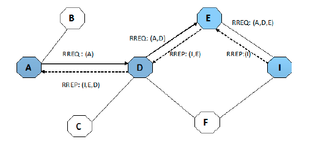

# AODVV2

This dodocument aims to explain the develoment process of the aodvv2 protocol , showing step by step the implementation of each related module in the process.

The  basic  operation  of  AODVv2 protocol are route discovery and route maintenance. Route 
discovery is  performed by  **sender node**  to a  **target node**  for which it does not have a valid route, and route maintenance is performed in order to avoid exiting eradicate routes from routing table and also to decrease packet dropping due to route breakage or node failure. This protocol can be work as both reactive and as proactive protocol. 


AODVv2 protocol implements three types of route messages during routing operations:
- Route Request (RREQ). 
- Route Reply (RREP).  
- Route Error (RERR). 
  
These are route control  messages used to  find and  maintain path from source node to any particular target node.


During  the  Route  discovery  process,  the  originating  node starts  broadcasting  of  Route  Request  (RREQ)  message throughout the network to find a path to a particular target node. Due  to AODVv2 path accumulation  function, each intermediate node  will attach  its  own address  to the  RREQ message. Each intermediate node that propagates  the RREQ message makes a note to the backward path, node  A is  the source node and  node I  is the  target node.  Thus, node  A generates RREQ  message  which  contains its  own address,  hop count,sequence number, target node address and then broadcast it on the network. Each  intermediate node  having a  valid path  to the  target  keeps  on  adding  its  own  address  and  sequence number with  the RREQ  message with nodes  D and  E, till target is  reached.  Upon sending  RREQ message in  the network, the  source node  waits for  a RREP (route  reply)  message.  The  target  node  replies  with  RREP message.  Incase no  RREP  is received  within  the  particular wait time; the source node may try again by sending another RREQ message after some time to discover the  route. In this way  AODVv2  discover  the  route  from  Source  node  to target node.  One of special feature of AODVv2 is energy efficient .If any node is low on energy; it has option to not engage in route discovery process. 


- Highest priority SHOULD be given to RREP_Ack messages. This allows learned routes to be confirmed as bidirectional and avoids undesirable blacklisting of next hop routers.
- Second priority SHOULD be given to RERR messages for undeliverable IP packets, so that broken routes that are still being used are reported, and to avoid IP data packets being repeatedly forwarded to AODVv2 routers which cannot forward to their destination.
- Third priority SHOULD be given to RREP messages in order that RREQs do not time out. 

RREQ messages SHOULD be given priority over RERR messages for newly invalidated routes, since the invalidated routes may not still be in use, and if there is an attempt to use the route, a new RERR message will be generated.
Lowest priority SHOULD be given to RERR messages generated in response to RREP messages which cannot be regenerated. In this case the route request will be retried at a later point.


# Route Discovery

During the Route discovery process, the originating node starts broadcasting of Route Request (RREQ) message throughout the network to find a path to a particular target node. Due to AODVv2 path accumulation function, each intermediate node will attach its own address  to the RREQ message. Each intermediate node that propagates the RREQ message makes a note to the backward path. Figure 3 shows AODVv2 route discovery process, node A is the source node and node I is the target node. Thus, node  A generates RREQ message which contains its own address,hop count, sequence number, target node address and then broadcast it on the network. Each intermediate node having a valid path to the target keeps on adding its own address and sequence number with the RREQ message as shown in figure 1  with nodes D and E, till target is reached. Upon sending RREQ message in the network,the source node waits for a RREP (route reply) message. The target node replies with RREP message.Incase no RREP is received within the particular wait time; the source node may try again by sending another RREQ message after some time to discover the route. In this way  AODVv2 discover the route from Source node  to target node. One of special feature of AODVv2 is energy efficient .If any node is low on energy; it has option to not engage in route discovery process.




## Generate a Route Request Message

Generate a route request message to find a route from OrigAddr to TargAddr using the given MetricType

**origAddr**   := IP address of Router Client which generated the packet to be forwarded.

**origPrefix** := prefix length associated with the Router Client.

**targAddr**   := destination IP address in the packet to be forwarded.

**targSeqNum** := sequence number in existing route to targAddr.

**mType**      := metric type for the requested route.


```cpp
Generate_RREQ(origAddr, origPrefix, targAddr, targSeqNum, mType)
{
    /* Increment sequence number in nonvolatile storage */
    mySeqNum := (1 + mySeqNum);

    /* Marshall parameters */
    outRREQ.HopLimit := MAX_HOPCOUNT;
    outRREQ.HopCount := 0;                              // if included 
    outRREQ.MetricType := mType;   //include if not DEFAULT_METRIC_TYPE
    outRREQ.OrigAddr := origAddr; 
    outRREQ.TargAddr := targAddr;
    outRREQ.OrigPrefixLen := origPrefix; //include if not address length
    outRREQ.OrigSeqNum := mySeqNum;
    outRREQ.TargSeqNum := targSeqNum;            //included if available
    outRREQ.OrigMetric := Route[OrigAddr].Metric;       //zero by default
    outRREQ.ValidityTime := limit for route to OrigAddr;   //if required 

    /* Build Address Blk using prefix length information from 
       outRREQ.OrigPrefixLen if necessary */
    AddrBlk := {outRREQ.OrigAddr, outRREQ.TargAddr};

    /* Include sequence numbers in appropriate Address Block TLVs */
    /* OrigSeqNum Address Block TLV */
    origSeqNumAddrBlkTlv.value := outRREQ.OrigSeqNum;
    /* TargSeqNum Address Block TLV */
    if (outRREQ.TargSeqNum is known)
        targSeqNumAddrBlkTlv.value := outRREQ.TargSeqNum;

    /* Build Metric Address Block TLV, include Metric AddrBlkTlv 
       Extension type if a non-default metric */
    metricAddrBlkTlv.value := outRREQ.OrigMetric;
    if (outRREQ.MetricType != DEFAULT_METRIC_TYPE)
        metricAddrBlkTlv.typeExtension := outRREQ.MetricType;
    
    if (outRREQ.ValidityTime is required)
    {
        /* Build VALIDITY_TIME Address Block TLV */
        VALIDITY_TIMEAddrBlkTlv.value := outRREQ.ValidityTime;
    }

    Build_RFC_5444_Message_Header (RREQ, 4, IPv4 or IPv6, NN,
        outRREQ.HopLimit, outRREQ.HopCount, tlvLength);

    /* multicast RFC 5444 message to LL-MANET-Routers */
}
```


